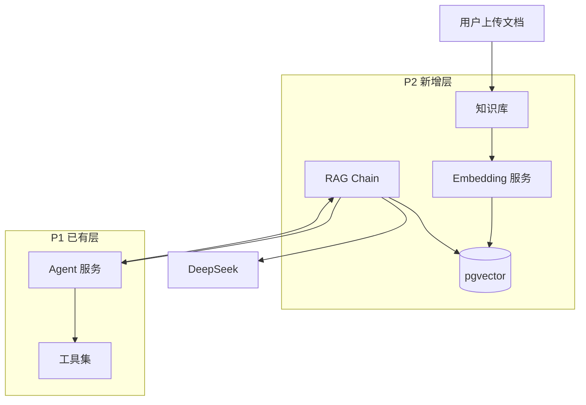
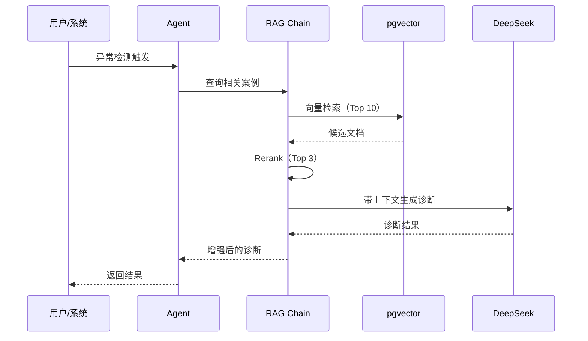

# 故障知识库 RAG Agent（P2）

## 📋 项目概述

基于 P1 的智能异常监控平台，增加 RAG（检索增强生成）能力，让 Agent 能够从历史故障文档库中检索相关案例，提升诊断准确率和解决方案质量。

**开发周期**：Day 15-30（60 天计划的第二个项目）

## 🎯 项目定位

### 核心价值
- **知识沉淀**：历史故障案例、解决方案自动入库
- **智能检索**：语义搜索 + 向量相似度匹配
- **增强诊断**：Agent 诊断时自动检索相关案例
- **持续学习**：用户反馈循环优化检索效果

### 技术亮点
- **向量数据库**：pgvector 扩展实现语义检索
- **Embedding 模型**：text-embedding-3-small（或国产替代）
- **RAG 链路**：LangChain.js 完整实现
- **Hybrid Search**：向量搜索 + 全文检索结合
- **Reranker**：二次排序提升准确率

## 🏗 技术架构

### 技术栈

```
在 P1 基础上新增：

后端：
  - pgvector（向量数据库扩展）
  - LangChain.js（RAG 框架）
  - @langchain/openai（Embedding）
  - Cohere Rerank（可选）

前端：
  - 知识库管理界面
  - 文档上传 / 编辑
  - 检索结果可视化

AI 层：
  - Embedding 模型（文本向量化）
  - RAG Chain（检索 + 生成）
  - Reranker（结果重排序）
```

### 系统架构图



### RAG 工作流



## 📊 数据模型扩展

在 P1 基础上新增表：

```prisma
// 知识库文档
model KnowledgeDocument {
  id          String   @id @default(uuid())
  title       String   @db.VarChar(200)
  content     String   @db.Text
  category    String   @db.VarChar(50) // fault_case / solution / guide
  tags        String[] // 标签数组
  source      String?  @db.VarChar(200) // 来源（用户上传/自动生成）
  embedding   Unsupported("vector(1536)")? // 向量
  metadata    Json?
  createdAt   DateTime @default(now())
  updatedAt   DateTime @updatedAt
  
  chunks      DocumentChunk[]
  
  @@index([category])
  @@map("knowledge_documents")
}

// 文档分块（长文档需要切分）
model DocumentChunk {
  id          String   @id @default(uuid())
  documentId  String
  chunkIndex  Int      // 第几块
  content     String   @db.Text
  embedding   Unsupported("vector(1536)")
  metadata    Json?
  
  document    KnowledgeDocument @relation(fields: [documentId], references: [id], onDelete: Cascade)
  
  @@index([documentId])
  @@map("document_chunks")
}

// 检索日志（用于 Eval）
model RetrievalLog {
  id          String   @id @default(uuid())
  query       String   @db.Text
  results     Json     // 检索到的文档 ID + 得分
  selected    String?  // 用户实际选择的文档 ID
  feedback    String?  // 用户反馈（helpful / not_helpful）
  createdAt   DateTime @default(now())
  
  @@map("retrieval_logs")
}
```

## 🎨 功能特性

### 1. 知识库管理
- 文档 CRUD（创建 / 读取 / 更新 / 删除）
- 批量上传（支持 Markdown / PDF / TXT）
- 自动分块（长文档按段落切分）
- 标签管理

### 2. 自动向量化
- 文档保存时自动 Embedding
- 增量更新（只重新向量化修改的文档）
- 批量处理（避免 API 限流）

### 3. 智能检索
- **语义检索**：基于向量相似度
- **全文检索**：基于关键词（Postgres FTS）
- **Hybrid Search**：两者结合，加权平均
- **Rerank**：Cohere Rerank 或自定义规则

### 4. Agent 集成
- 新增 `searchKnowledge` 工具
- Agent 诊断时自动调用
- 检索结果注入 prompt

### 5. 评估体系
- 检索准确率（Precision@K）
- 用户反馈收集
- A/B 测试框架

## 🚀 快速开始

### 环境要求
- P1 项目已完成
- Postgres 12+（支持 pgvector 扩展）
- OpenAI API Key（或其他 Embedding 服务）

### 安装 pgvector

```sql
-- 在 Postgres 中执行
CREATE EXTENSION IF NOT EXISTS vector;

-- 验证
SELECT * FROM pg_extension WHERE extname = 'vector';
```

### 安装依赖

```bash
cd backend
pnpm add langchain @langchain/openai @langchain/community
pnpm add pgvector-node
```

## 📖 核心代码示例

### Embedding 服务

```typescript
import { OpenAIEmbeddings } from '@langchain/openai';

@Injectable()
export class EmbeddingService {
  private embeddings = new OpenAIEmbeddings({
    openAIApiKey: process.env.OPENAI_API_KEY,
    modelName: 'text-embedding-3-small',
  });

  async embed(text: string): Promise<number[]> {
    return this.embeddings.embedQuery(text);
  }

  async embedBatch(texts: string[]): Promise<number[][]> {
    return this.embeddings.embedDocuments(texts);
  }
}
```

### 向量检索

```typescript
async vectorSearch(query: string, topK = 10) {
  const queryEmbedding = await this.embeddingService.embed(query);

  const results = await this.prisma.$queryRaw`
    SELECT 
      id, 
      content, 
      1 - (embedding <=> ${queryEmbedding}::vector) as similarity
    FROM document_chunks
    WHERE 1 - (embedding <=> ${queryEmbedding}::vector) > 0.7
    ORDER BY similarity DESC
    LIMIT ${topK}
  `;

  return results;
}
```

### RAG Chain

```typescript
import { RetrievalQAChain } from 'langchain/chains';

async ragQuery(question: string) {
  // 1. 检索相关文档
  const docs = await this.vectorSearch(question, 5);

  // 2. 构建上下文
  const context = docs.map(d => d.content).join('\n\n');

  // 3. 生成回答
  const result = await generateText({
    model: this.deepseek('deepseek-chat'),
    messages: [
      {
        role: 'system',
        content: `你是故障诊断专家。基于以下知识库内容回答问题：\n\n${context}`,
      },
      { role: 'user', content: question },
    ],
  });

  return result.text;
}
```

## 📈 性能指标

- **检索延迟**：P95 < 200ms
- **Embedding 延迟**：单文档 < 1s
- **检索准确率**：P@5 > 80%（Top 5 中有相关文档）
- **用户满意度**：Helpful Rate > 70%

## 🎓 学习价值

### 通过 P2 项目你将掌握

#### LangChain.js（占 40%）
- [x] Document Loaders
- [x] Text Splitters
- [x] Embeddings
- [x] Vector Stores
- [x] Retrievers
- [x] Chains（RAG Chain）

#### 向量数据库（占 30%）
- [x] pgvector 安装与配置
- [x] 向量索引（IVFFlat / HNSW）
- [x] 相似度计算（余弦 / 欧氏距离）
- [x] 混合检索策略

#### RAG 工程化（占 30%）
- [x] Chunking 策略（按段落 / 按语义）
- [x] Embedding 模型选择
- [x] Rerank 优化
- [x] RAG Eval 指标

## 🗺 后续扩展

P2 项目为 P3/P4 打基础：

- **P3（Day 31-45）**：多 Agent 基于知识库协作
- **P4（Day 46-60）**：知识图谱可视化

## 📝 License

MIT

---

**⭐ P2 项目让 Agent 真正"有记忆"！**
