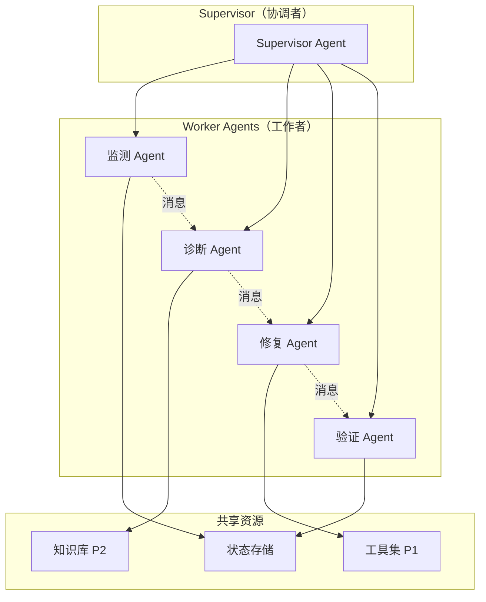
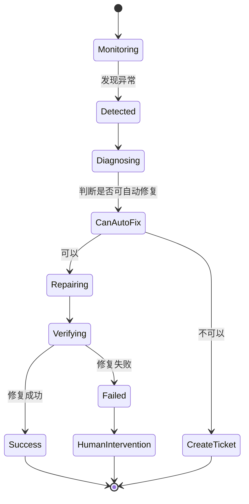

# 多 Agent 协作运维系统（P3）

## 📋 项目概述

基于 P1/P2 的能力，升级为多 Agent 协作系统，通过 LangGraph.js 编排 3 个专业 Agent（监测 Agent + 诊断 Agent + 修复 Agent），实现端到端的自动化运维闭环。

**开发周期**：Day 31-45（60 天计划的第三个项目）

## 🎯 项目定位

### 核心价值
- **专业分工**：每个 Agent 专注一个领域，提升准确率
- **协作编排**：LangGraph.js 状态机管理工作流
- **自主决策**：Agent 之间自主通信，无需人工干预
- **闭环处理**：从检测 → 诊断 → 修复 → 验证全自动

### 真实场景
```
传统模式（P1）：
  异常检测 → 单个 Agent 诊断 → 创建工单 → 人工修复

P3 多 Agent 协作：
  监测 Agent 持续扫描 
  → 发现异常立即通知诊断 Agent
  → 诊断 Agent 分析根因 + 检索知识库
  → 判断是否可自动修复
  → 修复 Agent 执行修复（重启服务/清理缓存/调整配置）
  → 验证 Agent 确认修复成功
  → 全程 < 5 分钟，无需人工
```

## 🏗 技术架构

### 技术栈

```
在 P1/P2 基础上新增：

核心框架：
  - LangGraph.js（Agent 编排）
  - StateGraph（状态机）
  - MessageGraph（消息传递）

Agent 协作：
  - Supervisor Pattern（监督者模式）
  - Hierarchical Agent（层级 Agent）
  - Human-in-the-loop（人机协作）

工程化：
  - LangSmith（监控与调试）
  - LangServe（Agent 部署）
  - Eval 自动化框架
```

### 系统架构



### LangGraph 工作流



## 📊 数据模型扩展

在 P1/P2 基础上新增：

```prisma
// Agent 工作流记录
model Workflow {
  id          String   @id @default(uuid())
  anomalyId   String   @unique
  status      String   // running / completed / failed
  currentStep String   // monitoring / diagnosing / repairing / verifying
  steps       Json[]   // 每一步的详细记录
  startedAt   DateTime @default(now())
  completedAt DateTime?
  durationMs  Int?
  
  anomaly     Anomaly  @relation(fields: [anomalyId], references: [id])
  
  @@map("workflows")
}

// Agent 消息记录
model AgentMessage {
  id          String   @id @default(uuid())
  workflowId  String
  fromAgent   String   // monitor / diagnose / repair / verify
  toAgent     String
  messageType String   // task / result / query / error
  content     Json
  createdAt   DateTime @default(now())
  
  @@index([workflowId])
  @@map("agent_messages")
}

// 修复操作记录
model RepairAction {
  id          String   @id @default(uuid())
  workflowId  String
  actionType  String   // restart_service / clear_cache / adjust_config
  target      String   // 操作目标（服务名/配置项）
  params      Json
  result      Json?
  status      String   // pending / success / failed
  createdAt   DateTime @default(now())
  
  @@map("repair_actions")
}
```

## 🎨 核心功能

### 1. Supervisor Agent（协调者）

**职责**：
- 接收监测 Agent 的异常报告
- 决定调用哪个 Agent
- 管理整体工作流状态

**实现**：
```typescript
const workflow = new StateGraph({
  channels: {
    anomaly: null,
    diagnosis: null,
    canAutoFix: null,
    repairResult: null,
  },
});

workflow.addNode('monitor', monitorAgent);
workflow.addNode('diagnose', diagnoseAgent);
workflow.addNode('repair', repairAgent);
workflow.addNode('verify', verifyAgent);

workflow.addEdge('monitor', 'diagnose');
workflow.addConditionalEdges('diagnose', (state) => {
  return state.canAutoFix ? 'repair' : 'create_ticket';
});
workflow.addEdge('repair', 'verify');
```

### 2. 监测 Agent

**职责**：
- 持续扫描指标异常（复用 P1 检测引擎）
- 智能过滤噪音（基于历史数据）
- 评估异常严重度

**新增能力**：
```typescript
// 基于历史数据的动态阈值
async intelligentDetect(metric: Metric) {
  const baseline = await this.getBaseline(metric.serverId, metric.metricType);
  const threshold = baseline.mean + 3 * baseline.stdDev;
  
  if (metric.value > threshold) {
    // 发送消息给诊断 Agent
    await this.sendMessage('diagnose', {
      type: 'anomaly_detected',
      data: metric,
    });
  }
}
```

### 3. 诊断 Agent

**职责**：
- 接收监测 Agent 的异常报告
- 调用 P2 的 RAG 检索相关案例
- 判断是否可自动修复

**决策逻辑**：
```typescript
async diagnose(anomaly: Anomaly) {
  // 1. 调用 RAG 检索相关案例
  const cases = await this.ragService.search(anomaly.type);
  
  // 2. 分析根因
  const rootCause = await this.analyzeRootCause(anomaly, cases);
  
  // 3. 判断是否可自动修复
  const canAutoFix = this.canAutoRepair(rootCause);
  
  if (canAutoFix) {
    await this.sendMessage('repair', {
      type: 'repair_request',
      rootCause,
      suggestedActions: ['restart_service', 'clear_cache'],
    });
  } else {
    await this.createTicket(anomaly, rootCause);
  }
}
```

### 4. 修复 Agent

**职责**：
- 接收诊断 Agent 的修复请求
- 执行自动化修复操作
- 记录修复过程

**支持的修复操作**：
```typescript
const repairActions = {
  restart_service: async (serviceName: string) => {
    // SSH 登录服务器，执行 systemctl restart
    await this.sshService.exec(`systemctl restart ${serviceName}`);
  },
  
  clear_cache: async (serverId: string) => {
    // 清理缓存
    await this.sshService.exec('rm -rf /tmp/cache/*');
  },
  
  adjust_config: async (configKey: string, value: any) => {
    // 调整配置并重新加载
    await this.configService.update(configKey, value);
  },
  
  scale_up: async (serverId: string) => {
    // 云厂商 API 调用，增加实例
    await this.cloudService.scaleUp(serverId);
  },
};
```

### 5. 验证 Agent

**职责**：
- 验证修复是否成功
- 持续观察 5 分钟
- 给出验证报告

**验证逻辑**：
```typescript
async verify(workflowId: string) {
  const workflow = await this.getWorkflow(workflowId);
  const anomaly = workflow.anomaly;
  
  // 等待 30s 让系统稳定
  await this.sleep(30000);
  
  // 检查指标是否恢复正常
  const currentMetric = await this.getLatestMetric(anomaly.serverId, anomaly.type);
  
  if (this.isNormal(currentMetric)) {
    // 持续观察 5 分钟
    for (let i = 0; i < 10; i++) {
      await this.sleep(30000);
      const metric = await this.getLatestMetric(anomaly.serverId, anomaly.type);
      if (!this.isNormal(metric)) {
        return { success: false, reason: '指标再次异常' };
      }
    }
    return { success: true };
  } else {
    return { success: false, reason: '指标未恢复' };
  }
}
```

## 📈 性能指标

- **端到端延迟**：异常 → 修复完成 < 5 分钟
- **自动修复率**：可自动修复的异常占比 > 60%
- **修复成功率**：自动修复的成功率 > 90%
- **误操作率**：< 1%（关键！自动修复不能出错）

## 🎓 学习价值

### 通过 P3 项目你将掌握

#### LangGraph.js（占 50%）
- [x] StateGraph 状态机设计
- [x] Conditional Edges（条件路由）
- [x] Message Passing（消息传递）
- [x] Checkpointing（状态持久化）
- [x] Human-in-the-loop（人机协作）

#### Multi-Agent 模式（占 30%）
- [x] Supervisor Pattern
- [x] Hierarchical Agent
- [x] Agent 通信协议
- [x] 冲突解决策略

#### Eval 体系（占 20%）
- [x] Agent 行为评估
- [x] 端到端测试
- [x] A/B 测试框架
- [x] LangSmith 集成

## 🗺 后续扩展

P3 项目为 P4 做准备：

- **P4（Day 46-60）**：3D 可视化 + Agent 工作流实时展示

## 📝 License

MIT

---

**⭐ P3 项目让多个 Agent 像团队一样协作！**
