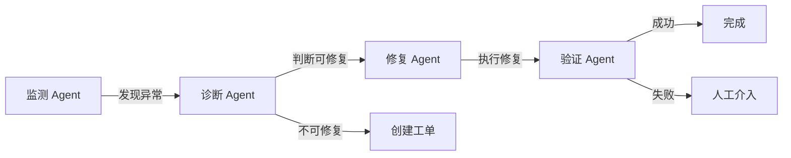

# P3 多 Agent 协作系统 - 产品需求文档（PRD）

## 📋 文档信息

| 项目 | 信息 |
|------|------|
| **项目名称** | 多 Agent 协作运维系统 |
| **项目代号** | P3-Multi-Agent |
| **版本** | v1.0 |
| **目标周期** | Day 31-45 |

## 1. 产品定位

### 1.1 一句话描述
基于 LangGraph.js，通过 4 个专业 Agent 协作，实现**异常检测 → 诊断 → 修复 → 验证**的全自动闭环。

### 1.2 核心价值

```
P1/P2 的局限：
  ❌ 单 Agent 全能但不专精
  ❌ 修复需要人工介入
  ❌ 工作流硬编码，不灵活

P3 的提升：
  ✅ 4 个专业 Agent 各司其职
  ✅ 60%+ 异常自动修复
  ✅ 端到端 < 5 分钟
  ✅ LangGraph 状态机灵活编排
```

### 1.3 4 个 Agent 角色



## 2. 功能需求

### 2.1 Agent 详细定义

#### 2.1.1 监测 Agent（Monitor Agent）

**职责**：
- 持续扫描指标异常（基于 P1 检测引擎）
- 智能过滤噪音
- 评估异常严重度

**输入**：
- metric.created 事件

**输出**：
- 异常报告 → 诊断 Agent

**核心能力**：
```typescript
interface MonitorAgent {
  detectAnomaly(metric: Metric): Promise<Anomaly | null>;
  assessSeverity(anomaly: Anomaly): Severity;
  filterNoise(anomaly: Anomaly): boolean;
}
```

#### 2.1.2 诊断 Agent（Diagnose Agent）

**职责**：
- 分析异常根因
- 调用 P2 RAG 检索相似案例
- 判断是否可自动修复

**输入**：
- 异常报告（来自监测 Agent）

**输出**：
- 诊断结果 + 修复决策

**决策逻辑**：
```typescript
async function diagnose(anomaly: Anomaly) {
  // 1. 查询当前状态
  const health = await getServerHealth(anomaly.serverId);
  
  // 2. RAG 检索
  const cases = await searchKnowledge(anomaly.type);
  
  // 3. 根因分析
  const rootCause = await analyzeRootCause({ anomaly, health, cases });
  
  // 4. 修复决策
  const canAutoFix = canAutoRepair(rootCause);
  
  return {
    rootCause,
    canAutoFix,
    suggestedActions: canAutoFix ? rootCause.solutions : [],
  };
}
```

**可自动修复的场景**：
- ✅ 重启服务（明确知道是哪个进程）
- ✅ 清理缓存（已知缓存路径）
- ✅ 调整配置（预定义的配置项）
- ❌ 硬件故障（需要人工）
- ❌ 复杂业务逻辑问题（需要人工）

#### 2.1.3 修复 Agent（Repair Agent）

**职责**：
- 接收修复指令
- 执行自动化修复
- 记录修复过程

**支持的修复操作**：
```typescript
const repairActions = {
  // 1. 重启服务
  restart_service: async (params: { serverId: string; serviceName: string }) => {
    return sshService.exec(params.serverId, `systemctl restart ${params.serviceName}`);
  },
  
  // 2. 清理缓存
  clear_cache: async (params: { serverId: string; path: string }) => {
    return sshService.exec(params.serverId, `rm -rf ${params.path}/*`);
  },
  
  // 3. 调整配置
  adjust_config: async (params: { configKey: string; value: any }) => {
    return configService.update(params.configKey, params.value);
  },
  
  // 4. 扩容（云厂商 API）
  scale_up: async (params: { serverId: string; cpu: number; memory: number }) => {
    return cloudService.scale(params);
  },
  
  // 5. 限流
  apply_rate_limit: async (params: { endpoint: string; rate: number }) => {
    return apiGateway.setRateLimit(params);
  },
};
```

**安全机制**：
```typescript
// 修复前确认
async function executeRepair(action: RepairAction) {
  // 1. 风险评估
  const risk = await assessRisk(action);
  
  // 2. 高风险操作需要人工确认
  if (risk === 'high') {
    return { status: 'pending_approval', action };
  }
  
  // 3. 执行修复
  const result = await repairActions[action.type](action.params);
  
  // 4. 记录到数据库
  await prisma.repairAction.create({ data: { ...action, result } });
  
  return { status: 'success', result };
}
```

#### 2.1.4 验证 Agent（Verify Agent）

**职责**：
- 验证修复是否成功
- 持续观察 5 分钟
- 给出验证报告

**验证流程**：
```typescript
async function verify(workflowId: string) {
  // 1. 等待 30s 让系统稳定
  await sleep(30000);
  
  // 2. 检查指标是否恢复
  const initial = await checkMetrics(serverId);
  if (!initial.normal) {
    return { success: false, reason: '修复后指标未恢复' };
  }
  
  // 3. 持续观察 5 分钟（10 次 × 30s）
  for (let i = 0; i < 10; i++) {
    await sleep(30000);
    const current = await checkMetrics(serverId);
    if (!current.normal) {
      return { success: false, reason: `第 ${i+1} 次检查再次异常` };
    }
  }
  
  return { success: true };
}
```

### 2.2 LangGraph 工作流

#### 2.2.1 状态定义

```typescript
import { StateGraph } from '@langchain/langgraph';

interface WorkflowState {
  anomaly: Anomaly | null;
  diagnosis: Diagnosis | null;
  repairResult: RepairResult | null;
  verifyResult: VerifyResult | null;
  status: 'monitoring' | 'diagnosing' | 'repairing' | 'verifying' | 'completed' | 'failed';
  history: WorkflowStep[];
}
```

#### 2.2.2 状态机定义

```typescript
const workflow = new StateGraph<WorkflowState>({
  channels: {
    anomaly: null,
    diagnosis: null,
    repairResult: null,
    verifyResult: null,
    status: 'monitoring',
    history: [],
  },
});

// 添加节点
workflow.addNode('monitor', monitorAgent);
workflow.addNode('diagnose', diagnoseAgent);
workflow.addNode('repair', repairAgent);
workflow.addNode('verify', verifyAgent);
workflow.addNode('createTicket', createTicketNode);
workflow.addNode('humanIntervention', humanInterventionNode);

// 添加边
workflow.addEdge('monitor', 'diagnose');

// 条件边：诊断后判断
workflow.addConditionalEdges('diagnose', (state) => {
  if (state.diagnosis.canAutoFix) {
    return 'repair';
  } else {
    return 'createTicket';
  }
});

workflow.addEdge('repair', 'verify');

// 条件边：验证后判断
workflow.addConditionalEdges('verify', (state) => {
  if (state.verifyResult.success) {
    return '__end__';
  } else {
    return 'humanIntervention';
  }
});

// 编译
const app = workflow.compile();
```

### 2.3 Human-in-the-loop（人机协作）

某些场景需要人工介入：

```typescript
// 高风险操作需要人工确认
workflow.addNode('humanApproval', async (state) => {
  // 发送通知给人工
  await notifyOperator({
    workflowId: state.id,
    action: state.diagnosis.suggestedActions[0],
    risk: 'high',
  });
  
  // 暂停工作流，等待人工响应
  return interrupt(state);
});

// 人工响应后恢复
async function approveRepair(workflowId: string, approved: boolean) {
  if (approved) {
    await app.resume(workflowId, { approved: true });
  } else {
    await app.resume(workflowId, { approved: false, action: 'create_ticket' });
  }
}
```

## 3. 性能指标

| 指标 | 目标 |
|------|------|
| 端到端延迟 | < 5 分钟 |
| 自动修复率 | > 60% |
| 修复成功率 | > 90% |
| 误操作率 | < 1% |
| Agent 协作开销 | < 10% |

## 4. Eval 体系

### 4.1 评估指标

```typescript
interface EvalMetrics {
  // 准确率
  diagnosisAccuracy: number;  // 诊断准确率
  repairSuccessRate: number;  // 修复成功率
  
  // 性能
  endToEndLatency: number;    // 端到端延迟
  agentOverhead: number;      // Agent 协作开销
  
  // 业务
  autoFixRate: number;        // 自动修复率
  humanInterventionRate: number; // 人工介入率
  falsePositiveRate: number;  // 误报率
}
```

### 4.2 自动化测试

```typescript
// 模拟异常 → 验证完整流程
describe('Multi-Agent Workflow', () => {
  it('应该完成 CPU 突增的端到端处理', async () => {
    // 1. 注入异常
    const anomaly = await injectAnomaly('cpu_spike', 'srv-001');
    
    // 2. 等待工作流完成
    const result = await waitForWorkflow(anomaly.id, { timeout: 600000 });
    
    // 3. 验证结果
    expect(result.status).toBe('completed');
    expect(result.verifyResult.success).toBe(true);
    expect(result.diagnosis).toBeDefined();
    expect(result.repairResult.action).toBe('restart_service');
  });
});
```

## 5. 项目里程碑

| 里程碑 | 时间 | 产出 |
|-------|------|------|
| M1 LangGraph 入门 | Day 31-32 | 第一个状态机 |
| M2 监测 Agent | Day 33 | 基于 P1 升级 |
| M3 诊断 Agent | Day 34-35 | 集成 P2 RAG |
| M4 修复 Agent | Day 36-37 | 5 类修复操作 |
| M5 验证 Agent | Day 38 | 完整验证逻辑 |
| M6 工作流编排 | Day 39-40 | LangGraph 完整集成 |
| M7 Human-in-loop | Day 41-42 | 人工介入机制 |
| M8 Eval 体系 | Day 43-44 | 自动化测试 |
| M9 上线复盘 | Day 45 | Demo + 简历 |

## 6. 验收标准

- [ ] 4 个 Agent 全部实现
- [ ] LangGraph 工作流跑通端到端
- [ ] 自动修复率 > 60%
- [ ] 修复成功率 > 90%
- [ ] Eval 自动化测试通过
- [ ] Human-in-loop 机制可用

---

**P3 项目让 Agent 像团队一样协作！**
