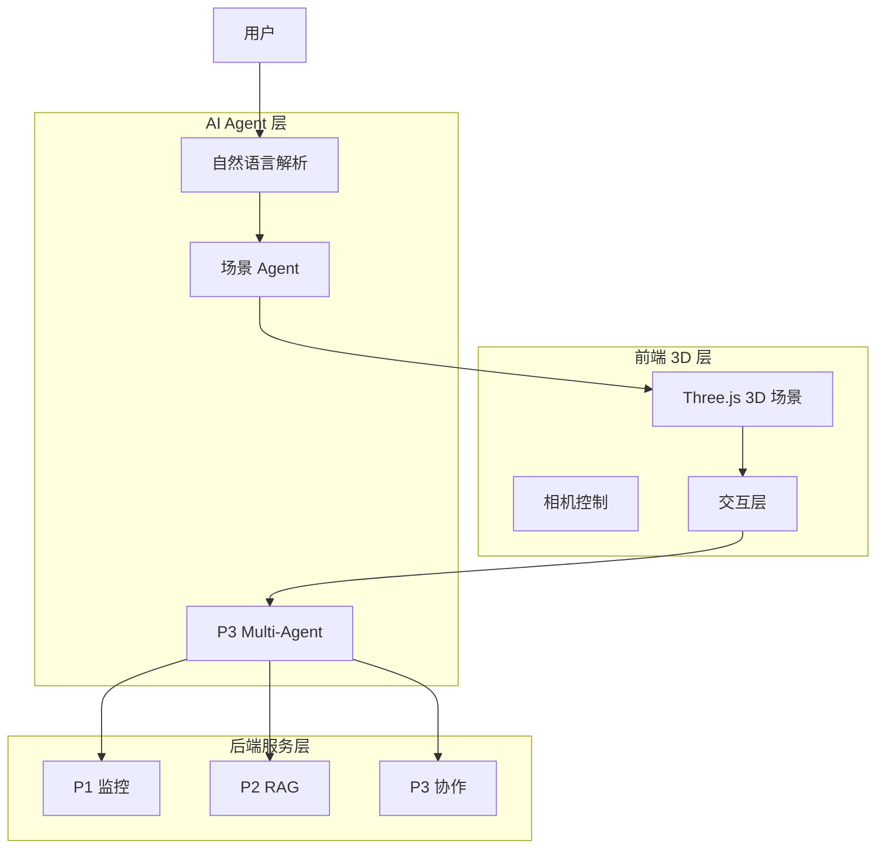

# 3D 智能机房平台（P4）

## 📋 项目概述

整合 P1/P2/P3 的所有能力，加上 Three.js 3D 可视化，打造一个**生产级、差异化、可上线**的 Agent 应用平台。这是 60 天计划的集大成之作。

**开发周期**：Day 46-60（60 天计划的第四个项目）

## 🎯 项目定位

### 核心价值
- **3D 差异化**：Three.js 3D 机房可视化（你的 6 年前端强项）
- **AI + 3D 联动**：自然语言操作 3D 场景
- **生产级**：真实用户 + 完整监控 + 持续运营
- **简历亮点**：市面上少有的 3D + AI Agent 结合案例

### 为什么做 P4
```
P1-P3 是能力积累：
  P1: 单 Agent + 实时监控
  P2: RAG 知识库
  P3: Multi-Agent 协作

P4 是综合展示：
  ✅ 技术深度：3D + AI 双技术栈
  ✅ 产品完整度：可上线、可运营
  ✅ 差异化：市面上少见
  ✅ 简历杀器：面试必聊
```

## 🏗 技术架构

### 技术栈

```
在 P1/P2/P3 基础上新增：

3D 可视化：
  - Three.js（3D 引擎）
  - @react-three/fiber（React 集成）
  - @react-three/drei（辅助工具）
  - Tween.js（动画）

AI + 3D 联动：
  - 自然语言解析 → 3D 操作
  - 3D 场景状态 → Agent 感知
  - 多模态：上传机房照片 → 识别设备

生产级工程：
  - Sentry（错误监控）
  - Plausible（用户分析）
  - PostHog（产品分析）
  - Cloudflare（CDN + 安全）
```

### 系统架构



## 🎨 核心功能

### 1. 3D 机房可视化

**场景设计**：
```typescript
// 机房布局
const Room = () => {
  return (
    <group>
      {/* 地板 */}
      <mesh rotation={[-Math.PI / 2, 0, 0]}>
        <planeGeometry args={[50, 30]} />
        <meshStandardMaterial color="#2a2a2a" />
      </mesh>

      {/* 服务器机柜 */}
      {servers.map((server) => (
        <ServerRack
          key={server.id}
          position={server.position}
          status={server.status}
          onClick={() => handleServerClick(server)}
        />
      ))}

      {/* 实时告警粒子效果 */}
      {anomalies.map((anomaly) => (
        <AlertParticles
          key={anomaly.id}
          position={getServerPosition(anomaly.serverId)}
          severity={anomaly.severity}
        />
      ))}
    </group>
  );
};
```

**交互功能**：
- 点击服务器 → 弹出详情面板
- 鼠标悬停 → 显示实时指标
- 异常告警 → 设备闪烁 + 粒子特效
- 相机漫游 → 自动巡航模式

### 2. 自然语言操作 3D

**场景示例**：
```
用户："帮我看看 A 机房的服务器"
  → Agent 解析意图
  → 相机飞向 A 机房
  → 高亮 A 机房所有服务器

用户："srv-001 在哪？"
  → Agent 定位 srv-001
  → 相机聚焦 srv-001
  → 显示详情面板

用户："哪些服务器有异常？"
  → Agent 查询异常列表
  → 在 3D 场景中标红
  → 相机依次巡航异常设备
```

**实现**：
```typescript
// NL 解析 Agent
const sceneAgent = new Agent({
  tools: [
    tool({
      name: 'moveCameraTo',
      description: '移动相机到指定位置',
      parameters: z.object({
        target: z.string().describe('目标：roomA / server:srv-001'),
      }),
      execute: async ({ target }) => {
        if (target.startsWith('room')) {
          camera.flyTo(rooms[target].position);
        } else if (target.startsWith('server:')) {
          const serverId = target.split(':')[1];
          camera.flyTo(servers[serverId].position);
        }
      },
    }),
    tool({
      name: 'highlightServers',
      description: '高亮显示指定服务器',
      parameters: z.object({
        serverIds: z.array(z.string()),
      }),
      execute: async ({ serverIds }) => {
        scene.highlightServers(serverIds);
      },
    }),
  ],
});
```

### 3. 多模态能力

**上传机房照片 → 自动识别设备**：
```typescript
// 使用 GPT-4V 或 Claude 3
async function recognizeDevices(imageUrl: string) {
  const result = await generateText({
    model: claude('claude-3-opus'),
    messages: [
      {
        role: 'user',
        content: [
          { type: 'image', image: imageUrl },
          { type: 'text', text: '识别图片中的服务器设备，返回 JSON：{ devices: [{ type, position, status }] }' },
        ],
      },
    ],
  });

  return JSON.parse(result.text);
}
```

### 4. Agent 工作流可视化

**实时展示 P3 的 Multi-Agent 协作过程**：
```typescript
// Agent 消息在 3D 场景中可视化
const AgentFlow = () => {
  return (
    <>
      {agentMessages.map((msg) => (
        <Line
          key={msg.id}
          points={[
            getAgentPosition(msg.fromAgent),
            getAgentPosition(msg.toAgent),
          ]}
          color={msg.type === 'error' ? 'red' : 'blue'}
          lineWidth={2}
        />
      ))}
    </>
  );
};
```

### 5. 生产级监控

**接入 Sentry + PostHog**：
```typescript
// Sentry 错误监控
Sentry.init({
  dsn: process.env.SENTRY_DSN,
  environment: 'production',
  tracesSampleRate: 1.0,
});

// PostHog 产品分析
posthog.init(process.env.POSTHOG_KEY, {
  api_host: 'https://app.posthog.com',
});

// 自定义事件
posthog.capture('agent_diagnosis_completed', {
  durationMs: 12345,
  toolCallsCount: 5,
  success: true,
});
```

## 📊 数据模型扩展

```prisma
// 3D 场景配置
model SceneConfig {
  id          String   @id @default(uuid())
  userId      String
  roomLayout  Json     // 机房布局配置
  cameraPos   Json     // 相机位置
  preferences Json     // 用户偏好设置
  updatedAt   DateTime @updatedAt
  
  @@map("scene_configs")
}

// 用户行为日志
model UserAction {
  id          String   @id @default(uuid())
  userId      String
  actionType  String   // click_server / nl_command / camera_move
  target      String?
  metadata    Json?
  createdAt   DateTime @default(now())
  
  @@index([userId, createdAt])
  @@map("user_actions")
}
```

## 📈 性能指标

- **3D 渲染**：60fps（100+ 设备）
- **首屏加载**：< 3s
- **NL 解析延迟**：< 500ms
- **相机动画**：流畅过渡
- **用户留存**：7 日留存 > 40%

## 🎓 学习价值

### 通过 P4 项目你将掌握

#### Three.js 3D（占 40%）
- [x] 场景搭建（Scene / Camera / Renderer）
- [x] 几何体与材质
- [x] 光照与阴影
- [x] 相机控制（OrbitControls）
- [x] 动画（Tween / GSAP）
- [x] 性能优化（InstancedMesh / LOD）

#### AI + 3D 联动（占 30%）
- [x] 自然语言解析
- [x] 多模态识别
- [x] 场景状态同步

#### 生产级工程（占 30%）
- [x] 错误监控（Sentry）
- [x] 用户分析（PostHog）
- [x] 性能监控（Lighthouse）
- [x] CDN 优化（Cloudflare）
- [x] SEO 优化

## 🚀 上线与运营

### 部署架构

```
前端：
  - Vercel / Netlify（自动部署）
  - Cloudflare CDN（全球加速）

后端：
  - 腾讯云 / 阿里云（国内访问）
  - Railway / Render（海外访问）

数据库：
  - Supabase（Postgres + pgvector）

监控：
  - Sentry（错误）
  - PostHog（用户行为）
  - UptimeRobot（可用性）
```

### 运营策略

**Day 50-60 重点**：
1. **真实用户获取**：
   - V2EX / 掘金发帖
   - Product Hunt 发布
   - Twitter / 小红书宣传

2. **用户反馈收集**：
   - 内置反馈表单
   - 定期用户访谈
   - NPS 评分

3. **持续迭代**：
   - 每周发布新功能
   - 根据数据优化体验

## 🏆 简历终极形态

```markdown
## 核心项目

### 3D 智能机房平台（个人项目）
**技术栈**：Vue 3 + Three.js + NestJS + LangGraph.js + Postgres + DeepSeek

**项目描述**：
结合 3D 可视化与 AI Agent 的生产级工业监控平台，实现自然语言操作 3D 场景、多 Agent 协作运维、端到端自动化闭环。

**核心功能**：
- 3D 可视化：Three.js 渲染 100+ 设备，60fps 流畅运行
- AI + 3D 联动：自然语言操作 3D 场景，多模态识别机房设备
- Multi-Agent 协作：监测→诊断→修复→验证，端到端 < 5 分钟
- RAG 知识库：pgvector 向量检索，检索准确率 > 80%

**技术亮点**：
- LangGraph.js 状态机编排 4 个专业 Agent
- pgvector + LangChain.js 实现生产级 RAG
- Three.js 性能优化（InstancedMesh / LOD）
- 完整工程化（Sentry + PostHog + CI/CD）

**项目成果**：
- 真实用户：100+ 人使用
- GitHub Star：500+（如果开源）
- 技术博客：掘金 10000+ 阅读
- Demo: https://your-domain.com

**个人收获**：
60 天从前端工程师转型为 Agent 全栈工程师，掌握 TS Agent 完整技术栈。
```

## 📝 License

MIT

---

**⭐ P4 项目是你的简历杀器！**
